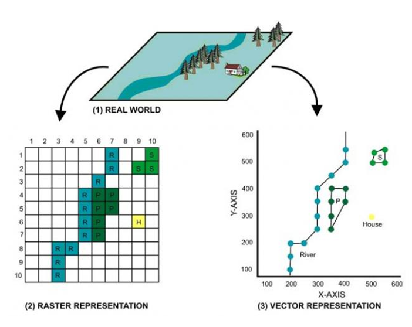

# Modelos de Datos Vectorial vs Raster en SIG

En el contexto de los Sistemas de Información Geográfica, el modelo de datos se refiere a la representación conceptual de cómo los datos geoespaciales y sus atributos se organizan y describen dentro de un sistema. Es una abstracción que define la naturaleza de los datos espaciales y no espaciales, así como las relaciones entre ellos. En otras palabras, es la forma en que se modela la realidad geográfica dentro del sistema. 

En los Sistemas de Información Geográfica (SIG), los **modelos vectorial** y **raster** son las dos formas principales de representar información espacial. Ambos tienen características, aplicaciones y limitaciones específicas. A continuación, se detalla la diferencia entre ellos:

## 1. Modelo de Datos Vectorial

El **modelo vectorial** representa la realidad mediante objetos geométricos (puntos, líneas y polígonos) que describen entidades espaciales bien definidas. Cada entidad puede asociarse con una serie de atributos que proporcionan información adicional (por ejemplo, nombre, tipo, tamaño).

### a. **Componentes del Modelo Vectorial**
- **Puntos**: Representan ubicaciones específicas en el espacio, sin extensión (0 dimensiones). Ejemplo: la ubicación de un árbol, una parada de autobús, o un semáforo.
- **Líneas**: Compuestas por varios puntos conectados, forman elementos lineales, como carreteras, ríos o vías ferroviarias (1 dimensión).
- **Polígonos**: Áreas cerradas formadas por líneas conectadas, que representan entidades con área, como lagos, parcelas o edificios (2 dimensiones).

### b. **Características Clave del Modelo Vectorial**
1. **Precisión geométrica**: Los datos vectoriales son muy precisos para definir los límites y la forma de los objetos. Por ejemplo, un polígono puede describir con precisión los límites de una propiedad o un lago.
2. **Almacenamiento de atributos**: Cada entidad vectorial (punto, línea o polígono) se asocia con una tabla de atributos que contiene información adicional. Por ejemplo, un polígono que representa una parcela puede tener atributos como el nombre del propietario, el área o el tipo de uso de suelo.
3. **Eficiencia en análisis topológicos**: Los datos vectoriales son adecuados para análisis topológicos, como detectar conexiones, intersecciones y adyacencias entre entidades espaciales.
4. **Tamaño del archivo**: Los datos vectoriales generalmente ocupan menos espacio de almacenamiento en comparación con los datos raster, especialmente cuando se representan grandes áreas con pocos detalles.

### c. **Aplicaciones Comunes del Modelo Vectorial**
- Creación de mapas temáticos y cartografía (uso del suelo, redes de transporte).
- Análisis de redes (rutas de transporte, infraestructuras eléctricas).
- Representación de límites precisos (parcelas catastrales, límites administrativos).
- Modelado y análisis espacial (p. ej., análisis de proximidad).

---

## 2. Modelo de Datos Raster

El **modelo raster** es una representación de la realidad espacial que divide el área en una cuadrícula regular de celdas o píxeles. Cada celda o píxel tiene un valor que representa una característica particular, como altitud, temperatura o uso del suelo. Es más adecuado para representar fenómenos continuos que cambian gradualmente en el espacio.

### a. **Componentes del Modelo Raster**
- **Celdas (píxeles)**: La unidad básica de un raster es una celda. Cada celda tiene un valor que puede representar diferentes tipos de datos (intensidad, valor categórico, etc.). Cuanto más pequeñas sean las celdas (mayor resolución), más detalle proporciona el mapa.
- **Dimensiones raster**: Los datos raster están organizados en filas y columnas, formando una cuadrícula regular.

### b. **Características Clave del Modelo Raster**
1. **Continuidad espacial**: Los raster son ideales para representar datos que varían continuamente en el espacio, como la altitud, la temperatura o la precipitación.
2. **Resolución**: La resolución espacial de un raster es el tamaño de cada celda. Una alta resolución significa celdas más pequeñas y más detalle, mientras que una baja resolución significa celdas más grandes y menos detalle.
3. **Valores de celdas**: Cada celda en un raster tiene un solo valor. Este valor puede representar datos categóricos (por ejemplo, tipos de suelo) o datos continuos (por ejemplo, elevación o temperatura).
4. **Tamaño del archivo**: Los datos raster pueden ocupar mucho espacio de almacenamiento, especialmente cuando la resolución es alta y el área cubierta es grande.

### c. **Aplicaciones Comunes del Modelo Raster**
- **Análisis de imágenes de satélite y aéreas**: Los raster son ideales para almacenar y analizar imágenes obtenidas por satélites o drones, que suelen cubrir grandes áreas con diferentes tipos de información.
- **Modelos de elevación**: Los modelos digitales de elevación (MDE) son un ejemplo típico de datos raster, donde cada celda representa la altura del terreno en ese punto.
- **Mapas de densidad**: Los datos raster son útiles para representar densidades, como el análisis de kernel o las densidades focales de puntos.
- **Modelado hidrológico**: Los datos raster se utilizan para analizar redes de drenaje, flujo de agua y cuencas hidrográficas.

---

## 3. Principales Diferencias entre los Modelos Vectorial y Raster

| Característica          | Modelo Vectorial                                    | Modelo Raster                                    |
|------------------------|-----------------------------------------------------|--------------------------------------------------|
| **Representación**      | Puntos, líneas y polígonos definidos por coordenadas precisas. | Cuadrícula regular de celdas o píxeles.          |
| **Tipo de datos**       | Ideal para datos discretos (límites, carreteras, edificios). | Ideal para datos continuos (elevación, temperatura). |
| **Almacenamiento**      | Los objetos vectoriales tienen atributos asociados. | Cada celda tiene un solo valor.                  |
| **Precisión**           | Alta precisión geométrica, adecuado para límites bien definidos. | Depende de la resolución; menos preciso para límites complejos. |
| **Tamaño del archivo**  | Generalmente más pequeño.                           | Generalmente más grande, especialmente con alta resolución. |
| **Análisis topológico** | Fuerte capacidad para análisis topológicos (intersecciones, proximidad). | Limitado para análisis topológicos; más útil para análisis de superficies. |
| **Aplicaciones**        | Uso del suelo, análisis de redes, límites administrativos. | Imágenes de satélite, análisis de elevación, clima, modelos de superficie. |

---

## 4. Cuándo Usar Vector o Raster

### Cuándo Usar **Datos Vectoriales**:
- Si necesitas representar entidades espaciales discretas con geometría precisa, como parcelas catastrales, edificios, carreteras o ríos.
- Si quieres realizar análisis espaciales que involucren proximidad o topología, como rutas más cortas o zonas de influencia.
- Si deseas crear mapas temáticos o representar datos con atributos detallados (nombres de calles, población, tipos de vegetación, etc.).

### Cuándo Usar **Datos Raster**:
- Si trabajas con fenómenos continuos que varían gradualmente en el espacio, como temperatura, elevación, precipitación o cobertura vegetal.
- Si necesitas procesar y analizar imágenes de satélite, de drones o de lidar.
- Para realizar análisis de grandes áreas y detectar patrones a nivel de superficie, como el flujo de agua en un modelo hidrológico o la erosión del suelo.

---

## 5. Mallas (Mesh)

Una malla es una cuadrícula no estructurada que suele tener componentes temporales y de otro tipo. El componente espacial contiene una colección de vértices, aristas y/o caras, en un espacio 2D o 3D:

- vértices - puntos XY(Z) (en el sistema de referencia de coordenadas de la capa)
- bordes - conecta pares de vértices
- faceta - una faceta es un conjunto de segmentos que producen una forma cerrada - tipicamente un triángulo o un cuadrilátero (cuadros), raramente polígonos con mas vértices

Las mallas (mesh) en QGIS no son exactamente raster ni vectorial en el sentido tradicional. Son un tercer tipo de datos espaciales que combinan características de ambos, dependiendo de cómo se utilicen:

- No son raster: En los datos raster, cada celda de la cuadrícula tiene un solo valor, y la resolución espacial es uniforme. Sin embargo, en las mallas, las celdas o polígonos pueden variar en forma y tamaño, y además pueden manejar múltiples variables por nodo o celda, lo que las hace más flexibles que los raster simples.

- No son vectoriales: A diferencia de los datos vectoriales (puntos, líneas, polígonos), las mallas no representan entidades geométricas individuales como carreteras o edificios, sino que son más bien un conjunto de nodos y celdas que representan un campo continuo de datos, como una superficie con variables asociadas (e.g., temperatura, velocidad del viento).

Diferencias clave:
- Las mallas están compuestas por nodos y celdas que forman una estructura irregular o regular.
- A diferencia de los raster, las celdas no son necesariamente cuadradas y no tienen una resolución fija.
- A diferencia de los vectores, no representan entidades geográficas discretas, sino fenómenos continuos que se modelan con interpolación entre nodos.

En definitiva, las mallas (mesh) son un tipo de datos espacial que combina aspectos de los raster (en cuanto a representar campos continuos) y de los datos vectoriales (en cuanto a su flexibilidad geométrica), pero no encajan completamente en ninguna de esas dos categorías clásicas.