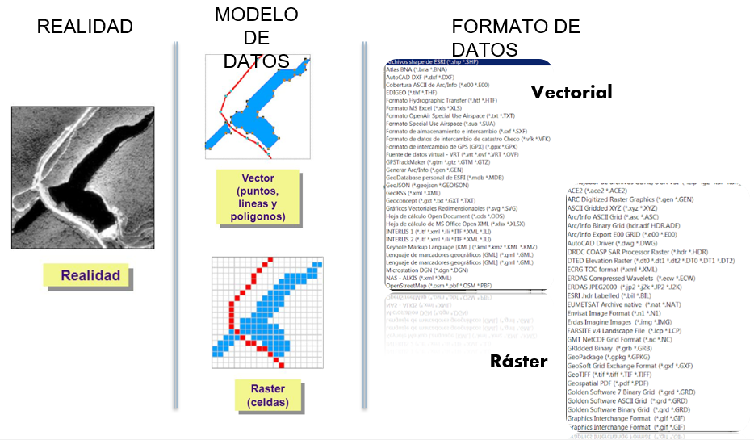

# Formatos de Datos en QGIS

El formato se refiere a la implementación física (informática) de los datos, es decir, cómo se almacenan y gestionan los datos en memoria o en archivos. Las estructuras de datos son más técnicas y detallan cómo los sistemas SIG manejan los datos a nivel interno, a nivel de bits y bytes. Es la manera en que los datos se organizan para garantizar una manipulación eficiente en las operaciones del sistema.

## Parte 1: Principales Formatos de Datos Vectoriales

[Datos vectoriales soportados por QGIS](https://docs.qgis.org/3.34/es/docs/user_manual/managing_data_source/opening_data.html)

### 1. Formato Shapefile (.shp)

El **Shapefile** es uno de los formatos más antiguos y ampliamente utilizados para almacenar datos vectoriales. Fue desarrollado por ESRI y es compatible con una amplia gama de software SIG, incluido QGIS.

#### Características del Shapefile:

- **Almacenamiento**: El formato Shapefile no es un archivo único, sino un conjunto de al menos tres archivos esenciales:
- **`.shp`**: Contiene la geometría de los objetos espaciales (puntos, líneas, polígonos).
- **`.shx`**: Índice de la geometría para mejorar la velocidad de acceso.
- **`.dbf`**: Archivo de base de datos donde se almacenan los atributos no espaciales de las entidades.

  Opcionalmente:

- **`.prj`**: Contiene información sobre el sistema de coordenadas y la proyección utilizada por los datos.
- **`.sbn`**: Archivo opcional que facilita la búsqueda rápida de entidades dentro del shapefile.
- **`.sbx`**: Archivo opcional que complementa el `.sbn` y mejora el rendimiento de las consultas espaciales.
- **`.ain`**: Archivo opcional que proporciona índices para acceder a los atributos almacenados en el archivo `.dbf`.
- **`.aih`**: Archivo opcional que complementa el `.ain` y mejora el rendimiento de las consultas de atributos.
- **`.xml`**: Archivo que puede contener metadatos sobre el shapefile, proporcionando información adicional sobre los datos.
- **Limitaciones**:
  - No permite almacenar geometrías mixtas (puntos, líneas y polígonos deben estar en archivos separados).
  - Tiene una limitación de 10 caracteres en los nombres de los campos.
  - No puede manejar conjuntos de datos grandes eficientemente, ya que cada archivo tiene un tamaño máximo de 2 GB.
- **Compatibilidad**: Amplia compatibilidad con software SIG. Es ideal para compartir datos entre diferentes plataformas, pero se está volviendo menos popular debido a las limitaciones mencionadas.

#### Ventajas:

- **Amplia compatibilidad**: Prácticamente todos los software de SIG pueden trabajar con shapefiles.
- **Sencillez**: Es fácil de manejar y transportar debido a su simplicidad.

#### Desventajas:

- **Limitaciones en la longitud de los campos y nombres**.
- **Tamaño de archivo limitado**.
- **Gestión de múltiples archivos**: Al ser un conjunto de archivos, no es un formato compacto.

---

### 2. Formato GeoPackage (.gpkg)

El **GeoPackage** es un formato más moderno que cumple con el estándar de OGC (Open Geospatial Consortium). Está diseñado para superar las limitaciones del Shapefile y es cada vez más común en proyectos SIG.

#### Características del GeoPackage:

- **Almacenamiento**: A diferencia del Shapefile, el GeoPackage es un archivo único con extensión `.gpkg` que contiene tanto los datos espaciales como los atributos. Almacena múltiples capas en un solo archivo.
- **Capacidad**: No tiene las restricciones de tamaño ni las limitaciones en los nombres de los campos como el Shapefile. Soporta geometrías mixtas y puede almacenar tanto datos vectoriales como raster en el mismo archivo.
- **Compatibilidad**: Aunque es un formato más moderno, QGIS y la mayoría de los SIG lo soportan, y su adopción está en crecimiento.

#### Ventajas:

- **Todo en uno**: El hecho de que sea un único archivo lo hace fácil de transportar y gestionar.
- **Sin limitaciones de tamaño**: Es adecuado para trabajar con grandes conjuntos de datos.
- **Almacena varias capas**: Puede contener múltiples capas de diferentes tipos en un solo archivo.

#### Desventajas:

- **Compatibilidad**: Aunque es compatible con la mayoría de los SIG modernos, algunos programas más antiguos pueden no soportarlo completamente.

---

## Parte 2: Servidores Web - Servicios WMS y WFS

En la era de los datos geoespaciales, es cada vez más común acceder a datos a través de servicios web, en lugar de almacenarlos localmente. Los **WMS** y **WFS** son los dos tipos más comunes de servicios web geoespaciales.

### 1. WMS (Web Map Service)

El **Web Map Service (WMS)** es un estándar que permite visualizar mapas desde un servidor remoto. Los mapas que se obtienen de un WMS son imágenes generadas dinámicamente en el servidor, basadas en solicitudes del cliente (como QGIS).

#### Características del WMS:

- **Datos rasterizados**: Un WMS devuelve imágenes (raster) en formatos como PNG o JPEG, lo que significa que no se puede interactuar directamente con los datos subyacentes (por ejemplo, hacer clic en un polígono para obtener información).
- **Capas pre-renderizadas**: Los mapas ya están preparados en el servidor y se renderizan a medida que el usuario los visualiza.

#### Ventajas:

- **Acceso a grandes conjuntos de datos** sin necesidad de descargarlos.
- **Actualización en tiempo real**: Permite acceder a datos actualizados directamente desde la fuente.

#### Desventajas:

- **No interactivo**: El usuario solo obtiene una imagen, no los datos crudos.
- **Depende de la velocidad de la conexión** a Internet.

### 2. WFS (Web Feature Service)

El **Web Feature Service (WFS)** es un estándar que permite acceder y manipular datos vectoriales desde un servidor remoto. A diferencia del WMS, el WFS proporciona los datos en bruto (geometría y atributos) que pueden ser editados y analizados.

#### Características del WFS:

- **Datos vectoriales**: A diferencia del WMS, el WFS devuelve datos en formato vectorial, lo que permite realizar análisis espaciales, seleccionar entidades y trabajar con los atributos.
- **Interactividad**: Los datos proporcionados pueden ser descargados, modificados y almacenados localmente.

#### Ventajas:

- **Interactividad completa**: Se pueden realizar consultas, análisis y edición de los datos recibidos.
- **Actualización en tiempo real**: Acceso a datos actualizados directamente desde el servidor.

#### Desventajas:

- **Más demandante en términos de ancho de banda**: Como se transfieren datos vectoriales completos, puede ser más lento que un WMS.
- **Requiere mayor procesamiento**: Dado que los datos crudos son más pesados que las imágenes raster, el procesamiento es mayor en el lado del cliente.

---

## Resumen

- **Shapefile**: formato clásico, ampliamente utilizado pero con limitaciones.
- **GeoPackage**: formato moderno, más flexible y potente.
- **WMS**: para visualizar mapas como imágenes.
- **WFS**: para acceder a datos vectoriales interactivos.

El conocimiento de estos formatos y servicios es esencial para un manejo eficiente de datos geoespaciales en QGIS.
