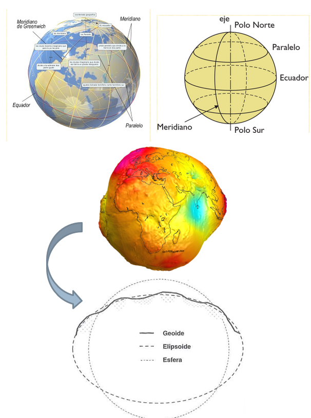
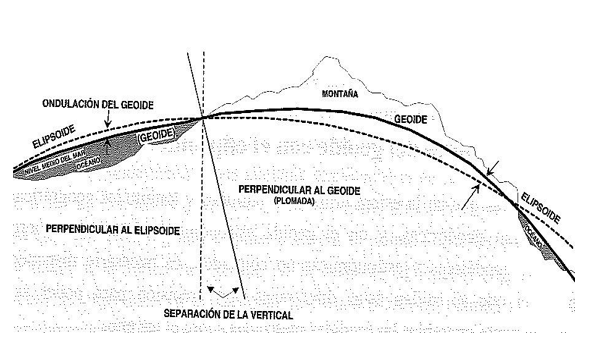
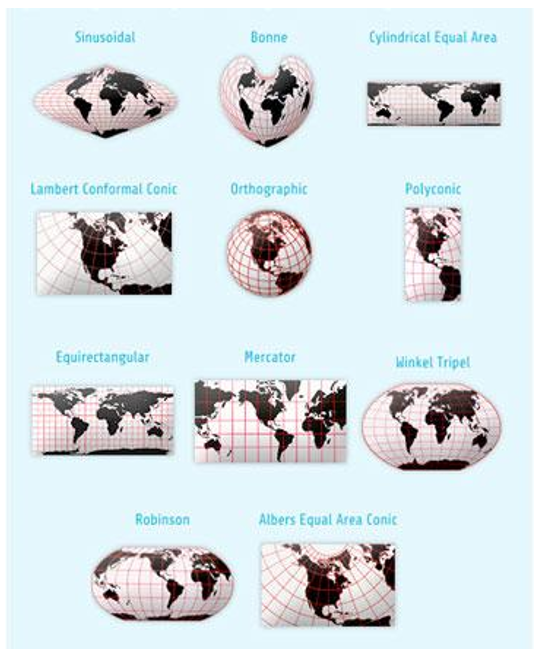
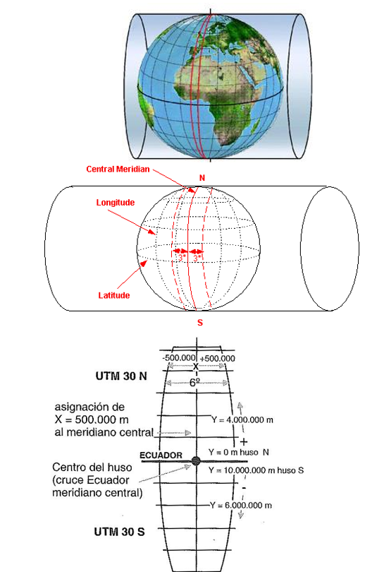

# Definición de un Sistema de Referencia sobre una Esfera

## Conceptos Fundamentales

- **Plano Horizontal**: 
  - El ecuador es el plano horizontal de referencia que divide la Tierra en dos hemisferios: el hemisferio norte y el hemisferio sur.

- **Plano Vertical**: 
  - El meridiano de Greenwich es el plano vertical que sirve como referencia para definir la longitud y se considera el meridiano cero.

- **Coordenadas Geográficas**: 
  - Se utilizan las coordenadas de **latitud** y **longitud** para especificar la ubicación de un punto en la superficie terrestre.
  - **Latitud**: Medida de la distancia al norte o al sur del ecuador.
  - **Longitud**: Medida de la distancia al este o al oeste del meridiano de Greenwich.

- **Medidas en Ángulos**: 
  - Las coordenadas geográficas se expresan en grados, minutos y segundos. Este enfoque puede presentar problemas en los software de Sistemas de Información Geográfica (SIG), especialmente al manejar cálculos de distancias y áreas.

- **Escalas Pequeñas**: 
  - Este sistema de referencia es adecuado para escalas pequeñas (por ejemplo, 1:1.000.000), donde la curvatura de la Tierra puede ser ignorada y la representación es más manejable.

## Limitaciones del Sistema Esférico

- El sistema descrito anteriormente es válido solo si la forma de la Tierra fuera esférica. Sin embargo, la realidad es que la superficie terrestre es irregular y tiene una forma más compleja.

- **Geoide**: 
  - La forma de la Tierra se asemeja a un geoide, que es una figura tridimensional que considera las variaciones en la gravedad y el nivel del mar. Esta irregularidad hace que las coordenadas geográficas sean menos precisas en ciertas aplicaciones.

## Necesidad de un Modelo Geométrico Regular

- Para superar las limitaciones del sistema esférico, es necesario encontrar una figura geométrica más regular para la representación de la superficie terrestre.

- **Elipsoide**: 
  - Un elipsoide es una forma geométrica que se aproxima a la forma de la Tierra. Utiliza dos ejes (uno mayor y uno menor) para describir la superficie terrestre de manera más precisa que una esfera.

- **Coordenadas Geodésicas**: 
  - Este sistema utiliza coordenadas geodésicas, que son un conjunto de coordenadas que se basan en un modelo elipsoidal de la Tierra. Las coordenadas geodésicas permiten realizar cálculos más precisos en aplicaciones de SIG y son fundamentales para la cartografía moderna.

# Relación Geoide-Elipsoide

## Introducción

Para asignar coordenadas geográficas a los diferentes puntos de la superficie terrestre, es fundamental alinear el elipsoide con el geoide en al menos un punto específico. Este punto de coincidencia es conocido como **Punto Fundamental** o **Datum**.

## Datum

- **Definición**: 
  - Un datum es un sistema de referencia que proporciona un marco de referencia para medir ubicaciones en la superficie terrestre. A través de este, se establecen coordenadas precisas que permiten la representación geográfica.

- **Ejemplo en Estados Unidos**: 
  - El datum más utilizado en Estados Unidos es el **WGS84** (World Geodetic System 1984), que es el estándar por defecto en muchos dispositivos GPS. Este sistema permite la ubicación precisa y la navegación a nivel global.

## Datum en la Península Ibérica

- **Hasta 2007**: 
  - En la Península Ibérica se utilizaba el **Datum Europeo de 1950** (ED50), que fue definido a partir de mediciones realizadas en la **Torre Helmert** de Potsdam, Alemania. El elipsoide de referencia utilizado en este datum fue el **Hayford**.

- **Desde 2007**: 
  - Se adoptó el **Sistema ETRS89** (European Terrestrial Reference System 1989) como el nuevo datum. Este sistema tiene como elipsoide de referencia el **GRS80** (Geodetic Reference System 1980), que proporciona una mejor aproximación a la forma de la Tierra en el contexto europeo.

# Sistemas de Coordenadas Terrestres

## Introducción

Los sistemas de coordenadas terrestres se basan en figuras tridimensionales que representan la forma de la Tierra, incluyendo:

- **Esfera**
- **Geoide**
- **Elipsoide**

## Proyecciones y Distorsiones

Al proyectar un sistema esférico sobre un plano, se producen distorsiones en las características geométricas de la superficie terrestre. Dependiendo del tipo de proyección utilizada, se pueden conservar diferentes magnitudes:

- **Ángulos**: 
  - Las **proyecciones conformes** son aquellas que conservan los ángulos, lo que es crucial para aplicaciones que requieren mediciones angulares precisas.

- **Superficies**: 
  - Las **proyecciones equivalentes** mantienen la proporción de las áreas, garantizando que las relaciones de superficie sean correctas en el mapa.

- **Longitud**: 
  - Las **proyecciones equidistantes** permiten que las distancias a lo largo de ciertas líneas sean representadas correctamente, aunque pueden distorsionar otras dimensiones.
  

## Proyección Universal Transversa Mercator (UTM)

La **Proyección Universal Transversa Mercator (UTM)** es un sistema de proyección cartográfica que utiliza un enfoque cilíndrico para representar la superficie terrestre. Esta proyección es ampliamente utilizada debido a su capacidad para minimizar las distorsiones en áreas relativamente pequeñas.

### Características de la Proyección UTM:

- **División en Zonas**: 
  - La proyección UTM divide el mundo en zonas de 6 grados de longitud, cada una con su propio sistema de coordenadas. Esto permite una representación más precisa en áreas específicas.

- **Conservación de Ángulos**: 
  - UTM es una proyección conforme, lo que significa que los ángulos son preservados, facilitando la navegación y la cartografía precisa.

- **Aplicaciones**: 
  - La proyección UTM es comúnmente utilizada en sistemas de información geográfica (SIG), planificación territorial, y en actividades de mapeo a nivel regional y local.

# Sistema de Referencia Geodésico

Un **sistema de referencia geodésico** es un modelo esencial para la descripción cuantitativa de posiciones y movimientos de cuerpos sobre la superficie terrestre. Este sistema permite la representación precisa de la ubicación de objetos en un contexto geográfico.

## Combinación de Elementos

Este sistema es una combinación de los conceptos previamente discutidos:

- **Elipsoide**: 
  - Representa una aproximación matemática de la forma de la Tierra, proporcionando una base para el cálculo de coordenadas geográficas.

- **Datum**: 
  - Define un marco de referencia que permite la medición precisa de coordenadas en relación con la superficie terrestre.

- **Sistema de Proyección**: 
  - Establece cómo se representan las coordenadas en un plano, minimizando las distorsiones y permitiendo la visualización efectiva de datos geoespaciales.

## European Petroleum Survey Group (EPSG)

El **European Petroleum Survey Group (EPSG)** es una organización que define un amplio conjunto de sistemas de referencia geodésicos y proyecciones cartográficas. Cada sistema en esta base de datos está identificado por un **código único** que facilita su uso en aplicaciones de SIG.

- **Recursos**: 
  - Puedes consultar la base de datos de sistemas de referencia EPSG en el siguiente enlace: [EPSG Reference](http://spatialreference.org/ref/epsg/).

- **Ejemplos de Códigos**: 
  - Algunos códigos importantes incluyen:
    - **25830** y **25831**: Sistemas de referencia utilizados en España.
    - **3042** y **3043**: Otros sistemas específicos definidos por EPSG.

# La Rejilla en QGIS

## Introducción

QGIS cuenta con un sistema de rejillas que facilita la transformación de coordenadas y el manejo de datos geoespaciales. Este sistema incluye dos rejillas específicas para diferentes regiones de España:

- **Península**: 
  - Rejilla denominada **PENR2009.gsb**.
  
- **Baleares**: 
  - Rejilla denominada **BALR2009.gsb**.

### Canarias

## Para configurar el SRS en QGIS:

Menú “Configuración”->”Opciones”

**RECOMENDACIONES**

- No habilitar reproyección al vuelo si no es necesario.
- Cuando se crea una capa nueva que no tiene SRC, preguntar SRC
- Preguntar la transformación de datum cuando no haya una predefinida 
