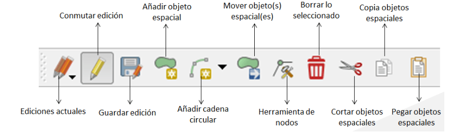

# Edición de Datos Vectoriales en QGIS

La edición de datos vectoriales es una de las habilidades fundamentales en el trabajo con Sistemas de Información Geográfica (SIG). QGIS proporciona herramientas para editar y crear datos vectoriales, que pueden ser puntos, líneas o polígonos. En este módulo, aprenderás a digitalizar datos geográficos y a manejar conceptos de topología que aseguran la integridad de tus datos.

## 1. Conceptos de Digitalización

La digitalización es el proceso de convertir datos geográficos del mundo real en un formato digital que pueda ser utilizado en un SIG. Este proceso puede implicar:

- **Captura de puntos**: Representa ubicaciones específicas (por ejemplo, árboles, faros).
- **Digitalización de líneas**: Representa entidades lineales (por ejemplo, ríos, carreteras).
- **Creación de polígonos**: Representa áreas cerradas (por ejemplo, lagos, parcelas de terreno).

### Tipos de Digitalización

- **Digitalización manual**: Implica trazar directamente sobre un mapa o imagen raster utilizando herramientas de QGIS.
- **Digitalización automática**: Utiliza algoritmos para convertir líneas de un mapa escaneado en geometría vectorial.

## 2. Herramientas de Edición en QGIS

Para editar datos vectoriales en QGIS, es necesario tener la capa en modo de edición. El proceso se describe a continuación:

### Activar el Modo de Edición

1. Carga la capa vectorial que deseas editar.
2. Haz clic derecho sobre la capa en el panel de capas o pulsa en el icono del lápiz del menú edición.
3. Selecciona "Activar edición" o haz clic en el icono de lápiz en la barra de herramientas.

### Crear y Editar Geometría

- **Añadir Puntos**:
  - Selecciona la herramienta "Añadir punto" en la barra de herramientas de digitalización.
  - Haz clic en el lugar del mapa donde deseas agregar el punto.

- **Dibujar Líneas**:
  - Selecciona la herramienta "Añadir línea".
  - Haz clic en el mapa para crear los vértices de la línea. Haz doble clic para finalizar la línea.

- **Crear Polígonos**:
  - Selecciona la herramienta "Añadir polígono".
  - Haz clic en el mapa para definir los vértices del polígono. Haz doble clic para cerrar el polígono.

### Editar Geometría Existente

- **Mover Puntos**: Selecciona la herramienta "Mover" y arrastra los puntos a la nueva ubicación.
- **Eliminar Elementos**: Selecciona la geometría que deseas eliminar y presiona la tecla `Supr` o usa la opción "Eliminar" del menú contextual.
- **Dividir y Combinar Líneas o Polígonos**: Utiliza las herramientas "Dividir" y "Unir" para modificar la geometría según sea necesario.

## 3. Conceptos de Topología

### ¿Qué es la Topología?

La topología se refiere a la relación espacial entre diferentes entidades geográficas. En la edición de datos vectoriales, es crucial mantener la integridad topológica para evitar errores en la representación de los datos.

### Reglas Topológicas

- **Conectividad**: Las líneas deben conectarse en puntos comunes.
- **No superposición**: Los polígonos no deben superponerse, a menos que sea intencional.
- **Contigüidad**: Los polígonos que comparten un límite deben coincidir exactamente.

### Herramientas de Validación Topológica en QGIS

QGIS ofrece herramientas para validar la topología de tus datos:

1. Ve a **Vector** > **Herramientas de Geometría** > **Validar geometría**.
2. Selecciona la capa que deseas validar.
3. Revisa los errores topológicos que se indiquen y corrígelos según sea necesario.

## 4. Guardar Cambios y Finalizar la Edición

Una vez que hayas realizado todas tus modificaciones:

1. Haz clic en el icono de lápiz para desactivar el modo de edición.
2. Se te preguntará si deseas guardar los cambios. Haz clic en "Sí" para guardar.

## Conclusiones

La edición de datos vectoriales es una habilidad esencial en QGIS, permitiendo a los usuarios crear y modificar datos geográficos de manera efectiva. La comprensión de la digitalización y la topología asegurará que tus datos sean precisos y útiles para el análisis geoespacial. A medida que avances en el uso de QGIS, estas habilidades te serán invaluables en tus proyectos de SIG.

## Recursos adicionales

- [Documentación de QGIS](https://docs.qgis.org)
- [Tutoriales de QGIS](https://www.qgistutorials.com)
