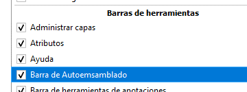
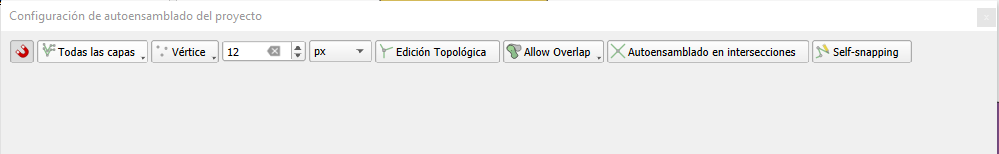

# Definición de reglas topológicas

Fuente: https://docs.qgis.org/3.34/es/docs/user_manual/working_with_vector/editing_geometry_attributes.html#snapping-options

## Propiedades

Para definir la tolerancia de autoensamblado es preciso cargar a la interfaz del programa la barra de "Herramientas de Autoensamblado". Para ello, tenemos que pulsar con el botón del ratón sobre un espacio en blanco de las barras de herramientas.

Desde el menú Proyecto ► Opciones de Autoensamblado es posible configurar las propiedades de las de capas de ajuste, límite de escala, topología…) 

Por defecto, la función de ajuste no está activa en un proyecto hasta que se hace clic en el botón
 o se presiona la tecla S. Además, es posible personalizar el modo de ajuste, así como definir el valor de la tolerancia y las unidades correspondientes, todo ello desde esta misma barra de herramientas.

## Opciones para ajustar capas en QGIS

Hay tres opciones para seleccionar la(s) capa(s) a las que se ajustará el cursor:

- **Todas las capas**: ajusta el puntero a todos los vértices y/o segmentos de las capas visibles en el proyecto. Útil para la mayoría de los casos, pero puede afectar el rendimiento en proyectos con muchas capas vectoriales.

- **Capa actual**: ajusta solo a la capa activa, asegurando la coherencia topológica durante la edición de esa capa.

- **Configuración avanzada**: permite habilitar y ajustar el modo de ajuste, la tolerancia, las unidades y las escalas en una capa específica. Asegúrate de que la capa de destino esté seleccionada y ajusta la tolerancia si es necesario.

## Modos de ajuste disponibles

Al mover o crear vértices, puedes elegir entre los siguientes modos:

- **Vértice**: ajusta a los vértices de las capas seleccionadas.
- **Segmento**: ajusta a lo largo de una línea o perímetro de un polígono.
- **Área**: ajusta en cualquier parte del área de un polígono.
- **Centroide**: ajusta al centroide de la geometría de un objeto espacial.
- **Medio**: ajusta al punto medio de los segmentos.
- **Punto final**: ajusta al primer o último vértice de una línea o polígono.

Los valores de tolerancia se pueden establecer en las unidades del mapa del proyecto o en píxeles. La ventaja de elegir píxeles es que mantiene el ajuste constante en diferentes escalas de mapa. Normalmente, de 10 a 12 píxeles es un buen valor, pero depende del DPI de su pantalla. El uso de unidades de mapa permite relacionar la tolerancia con las distancias reales. 

## Configuraciones de Superposición en QGIS
- **Permitir superposición (predeterminado)**: permite que las geometrías se superpongan sin restricciones.
- **Evitar superposición en capa activa**: evita que las nuevas geometrías se superpongan con otras entidades en la capa que se está editando. QGIS ajustará las geometrías nuevas para evitar superposiciones.
- **Seguir configuración avanzada**; permite establecer configuraciones de superposición específicas para cada capa utilizando la vista de **Configuración avanzada**.
- **Autoensamblar en edición** permite ajustar las intersecciones de geometría de las capas habilitadas para autoensamblar incluso si no hay vértices en las intersecciónes.
- **Edición topológica** ayuda a QGIS a detectar límites compartidos. Cuando se muevan los segmentos comunes, el programa también los moverá en las geometrías de las entidades adyacentes.

