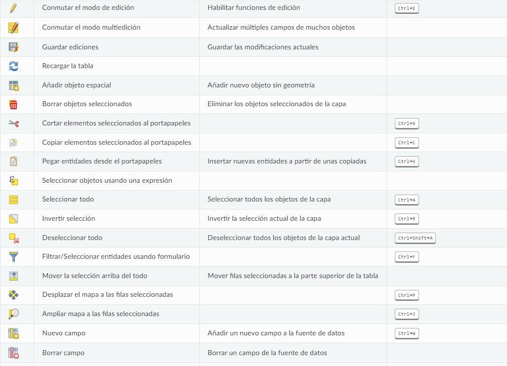
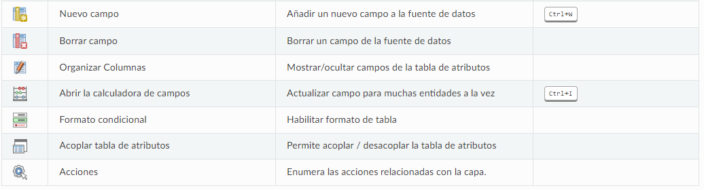
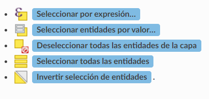

# Tratamiento de Datos Alfanuméricos y Tablas de Atributos

## 1. Introducción a los Datos Alfanuméricos

### 1.1. Definición de datos alfanuméricos
Los datos alfanuméricos proporcionan información contextual que complementa las representaciones espaciales de los datos geográficos. Sin estos atributos, el mapa sería solo una representación visual sin significado. Además, permiten realizar análisis complejos, como la identificación de patrones y tendencias en la distribución de recursos.

 En el contexto de GIS, estos datos son esenciales para describir y categorizar las características de las entidades geográficas. Ejemplos comunes incluyen nombres de calles, códigos postales, poblaciones, características demográficas, etc.

 Las tablas no espaciales pueden ser examinadas y modificadas a través de la vista de la tabla de atributos. Además, estas tablas son útiles para realizar búsquedas en campos. Por ejemplo, es posible utilizar las columnas de una tabla no espacial para definir valores de atributo o establecer un rango de valores permitidos que se añadirán a una capa vectorial específica durante el proceso de digitalización. 

### 1.3. Estructura de las tablas de atributos en QGIS
Las tablas de atributos son tablas que contienen información asociada a entidades geográficas. Cada fila de la tabla representa una entidad  y cada columna representa un atributo  La estructura de la tabla se define por su esquema, que puede incluir diferentes tipos de datos (numéricos, texto, fechas).

## 2. Gestión de Tablas de Atributos

### 2.1. Navegación por la tabla de atributos
#### 2.1.1. Visualización de atributos
# Abriendo la Tabla de Atributos en QGIS

Para acceder a la tabla de atributos de una capa vectorial, primero debes activar la capa haciendo clic en ella en el Panel de Capas. Luego, desde el menú principal, selecciona **Capa** y elige la opción 
**Abrir tabla de atributos**. También puedes hacer clic derecho sobre la capa y seleccionar 
**Abrir tabla de atributos** en el menú contextual, o utilizar el botón de 
**Abrir tabla de atributos** en la barra de herramientas de Atributos. Si prefieres utilizar atajos de teclado, puedes pulsar **F6** para abrir la tabla de atributos. El atajo **Shift + F6** abrirá la tabla filtrada a las entidades seleccionadas, mientras que **Ctrl + F6** abrirá la tabla filtrada a las entidades visibles.

Al abrir la tabla, se mostrará una nueva ventana que presenta los atributos de las entidades de la capa. La visualización de la tabla depende de la configuración en **Configuración -> Opciones -> Menú de fuentes de datos**, donde puedes elegir si la tabla de atributos se abrirá en una ventana acoplada o en una ventana independiente. En el título de la tabla de atributos se muestra el número total de entidades en la capa, así como la cantidad de entidades que están actualmente seleccionadas o filtradas, además de indicar si la capa está espacialmente limitada.

Los botones de la parte superior ofrecen las siguientes funcionalidades:

*Fuente: manual online QGIS:https://docs.qgis.org/3.34/es/docs/user_manual/working_with_vector/attribute_table.html

## Tipos de datos

- Número entero: -32.768 a 32.767
- Entero 64 bit:  -2.147.483.648 a 2.147.483.647
- Decimal (real):
  - Longitud: indica el número de dígitos que se puede almacenar en el campo  
  - Precisión: número de decimales que presenta el campo
- Texto: cadena de caracteres
- Fecha:  formato por defecto YYYY-MM-DD

#### 2.1.2. Edición de atributos
Es posible editar atributos directamente en la tabla. Haz clic en el botón de edición 
 (lápiz) en la barra de herramientas de la tabla. Luego, selecciona la celda que deseas modificar y realiza los cambios. 
 Guarda los cambios antes de cerrar la tabla.

 ## Edición de Valores de Atributos

La edición de los valores de los atributos se puede realizar de varias maneras:

1. **Escribiendo el nuevo valor directamente en la celda**
2. **Usando la calculadora de campos**
3. **Utilizando el campo rápido (barra de cálculo)**
4. **Activando el modo de multiedición**

### 2.1.3 Selección de Objetos Espaciales

### 16.2.3.1. Selección de Objetos Espaciales

En la vista de tabla, cada fila de la tabla de atributos representa los atributos de una entidad individual de la capa. Al seleccionar una fila, se selecciona automáticamente la entidad correspondiente. De manera similar, al hacer clic en una entidad en el lienzo del mapa (si la capa tiene geometría habilitada), la fila asociada se selecciona en la tabla de atributos. Si se modifica el conjunto de entidades seleccionadas en el mapa o en la tabla, la selección se actualizará simultáneamente en ambos lugares.

Para seleccionar registros, simplemente haz clic en el número de registro en el lado izquierdo de la fila. Puedes seleccionar múltiples registros manteniendo presionada la tecla **Ctrl**. Si deseas realizar una selección continua, mantén presionada la tecla **Shift** y haz clic en los encabezados de registro del lado izquierdo; esto seleccionará todos los registros entre la posición actual del cursor y el registro en el que haces clic. Ten en cuenta que al mover el cursor en la tabla de atributos haciendo clic en una celda, no se modificará el registro seleccionado. Cambiar la selección en el lienzo del mapa no afecta la posición del cursor en la tabla de atributos.

### 2.2. Importación de datos alfanuméricos
#### 2.2.1. Importación desde archivos CSV
1. Selecciona "Capa" > "Añadir capa" > "Añadir capa de texto delimitado".
2. Selecciona el archivo CSV y configura los parámetros (separador, encoding).
3. Asegúrate de que el archivo tenga coordenadas geográficas si deseas visualizarlo en el mapa.
4. Haz clic en "Añadir" para importar los datos.

#### 2.2.2. Importación desde Excel
1. Es posible añadir tablas en formato excel directamente en el proyecto arrastrando el archivo xlsx al mismo.

#### 2.2.3. Vinculación de datos de poblaciones, vías y cuencas
Utiliza las herramientas de QGIS para vincular datos alfanuméricos de diferentes fuentes (CSV, bases de datos) a las capas geográficas, utilizando atributos comunes como ID o nombre.

### 2.3. Filtrado de datos
#### 2.3.1. Filtrado mediante expresiones
1. Abre la tabla de atributos.
2. Haz clic en "Mostrar filtro" y selecciona "Crear filtro".
3. Utiliza el generador de expresiones para definir condiciones (ej., `"población" > 1000`).
4. Aplica el filtro para visualizar solo los registros que cumplan la condición.

#### 2.3.2. Filtrado mediante la barra de herramientas
La barra de herramientas de la tabla de atributos permite aplicar filtros rápidos utilizando los iconos de búsqueda y filtrado.

### 2.4. Exportación de tablas de atributos
#### 2.4.1. Exportación a CSV
1. Abre la tabla de atributos que deseas exportar.
2. Haz clic en el icono "Guardar como" y selecciona "Guardar como CSV".
3. Configura las opciones de exportación y guarda el archivo.

#### 2.4.2. Exportación a otros formatos
QGIS permite exportar a varios formatos, como Shapefile, GeoPackage, etc. El proceso es similar al de la exportación a CSV; simplemente selecciona el formato deseado en la ventana de exportación.

