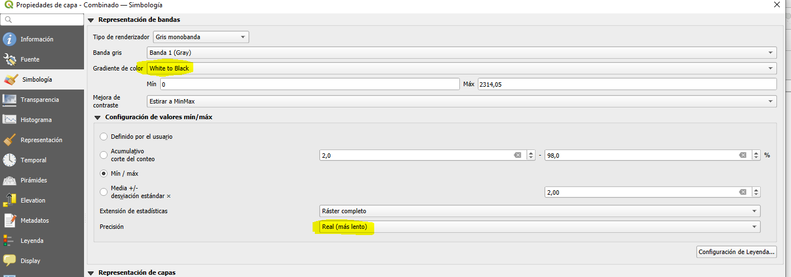
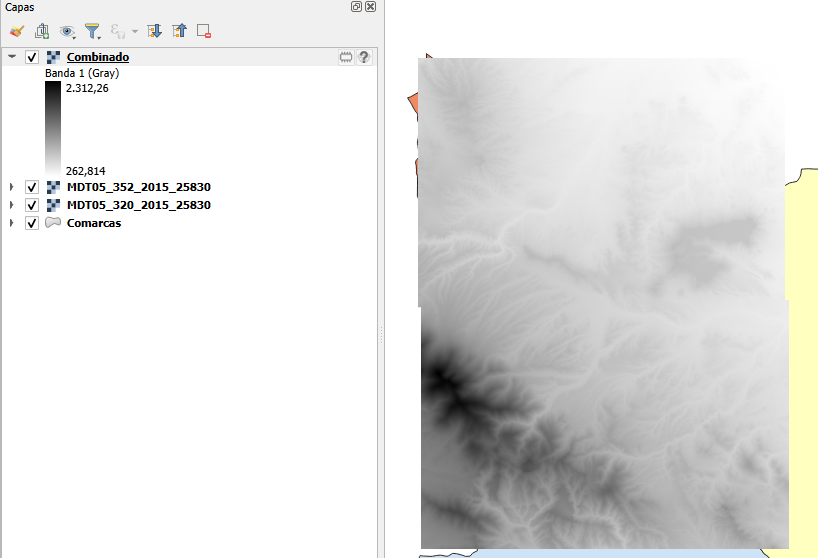

## COMBINAR MDE

Añadimos los dos ficheros .asc a nuestro proyecto con la opción "Añadir capa ráster". Para combinarlas, utilizaremos el comando "Combinar" del menú superior "Ráster" - "Miscelánea".

- En  "Avanced Parameters" - Input pixel value to treat as NoData y en - Assign specified NoData value to ouput, introducir el valor correspondiente a NODATA del fichero ASCII.

Una vez combinadas las capas, ajustamos los valores de visualización de la capa resultante para su correcta representación:

- Gradiente de color: White to Black.
- Configuración de valores mín/máx-Precisión: Real (más lento).

El resultado de las capas combinadas debería verse así:

