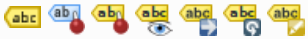

# Etiquetado en QGIS 

El etiquetado en QGIS permite identificar de forma visual elementos en una capa mediante texto o etiquetas. 

Por defecto, las capas en QGIS no muestran etiquetas. Puedes habilitar el etiquetado en la pestaña **Etiquetas** dentro de las propiedades de la capa.

## 1.1 Etiquetas sencillas
Permite etiquetar las entidades de una capa utilizando un campo de datos.

- Selecciona **Etiquetas sencillas** en la pestaña de **Etiquetas**.
- Elige el campo por el cual etiquetar.
- Personaliza el **tipo de letra**, **tamaño**, **color**, etc.
- Haz clic en **Aplicar** y **Aceptar** para visualizar las etiquetas en la capa.

## 1.2 Etiquetado basado en reglas
El etiquetado basado en reglas permite aplicar múltiples configuraciones de etiqueta de manera selectiva.

- En el menú de **Etiquetas**, haz clic en **Agregar regla**.
- Define una **expresión** para filtrar las características y personaliza las opciones de etiquetado (campo, tipo de letra, color, etc.).
- Establece un intervalo de escala si es necesario para que la regla se aplique solo en ciertos niveles de zoom.
- Haz clic en **Aplicar** y **Aceptar**  para visualizar las etiquetas personalizadas.

Ver manual online QGIS https://docs.qgis.org/3.34/es/docs/training_manual/vector_classification/label_tool.html

# 2. Desplazar etiquetas manualmente

Aunque QGIS posiciona las etiquetas automáticamente, puede ser necesario moverlas manualmente para mejorar la legibilidad del mapa y evitar solapamientos.

### Activa el panel "Etiqueta"

 

- Haz click en el icono de mover etiqueta .
- Haz clic en la etiqueta que deseas mover y arrástrala hasta la posición deseada.
- Suelta el botón del mouse para fijar la etiqueta en la nueva ubicación.

> **Tip**: Puedes hacer zoom en áreas específicas para una colocación más precisa de las etiquetas.

### Ajustes de Posicionamiento de Etiquetas

Además de mover manualmente, el panel de **Posicionamiento** ofrece opciones adicionales para ajustar la orientación y el ángulo de las etiquetas. Algunos de los ajustes importantes incluyen:

- **Desplazamiento**: Modifica el desplazamiento de la etiqueta respecto al punto de referencia de la geometría.
- **Rotación**: Permite girar la etiqueta en torno a su punto central.
- **Margen**: Define el margen de separación entre la etiqueta y otros elementos en el mapa.