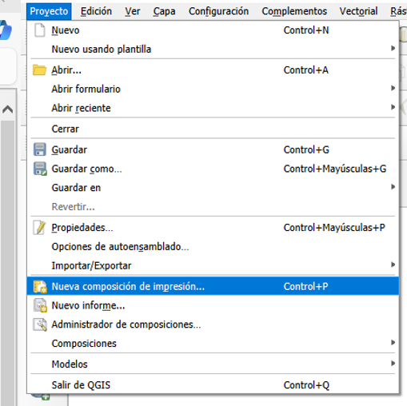
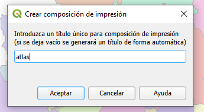
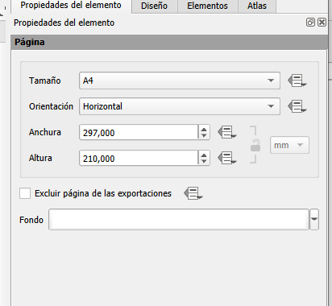
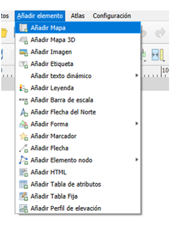
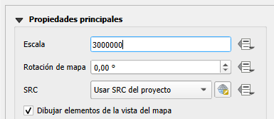

# Composición de mapa

- En “Propiedades del elemento” define la  escala En el menú “Proyecto”- selecciona -Nuevo diseñador de impresión”.
 
 

 - Asigna un nombre al diseñador que se va a crear.

 

 - Define el  tamaño y orientación de la composición de mapa.
 
 

- Añade la  vista al mapa.

- En “Propiedades del elemento” ajusta la  escala.

