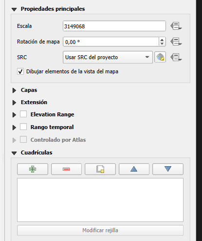
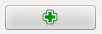
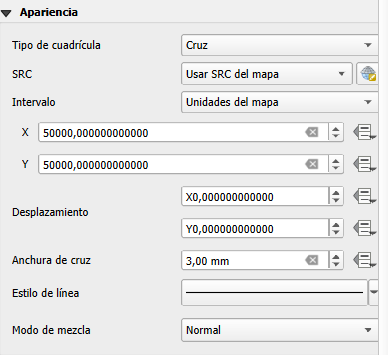
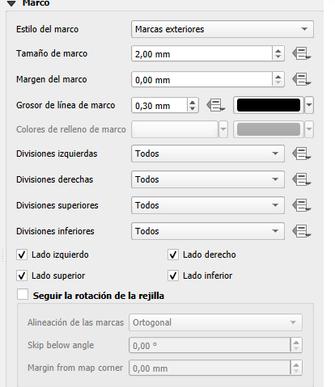
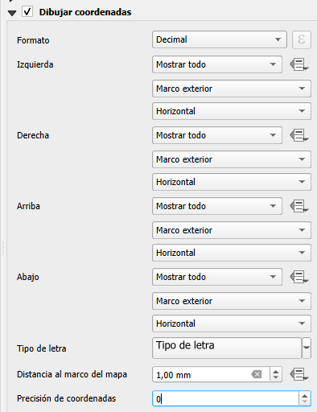
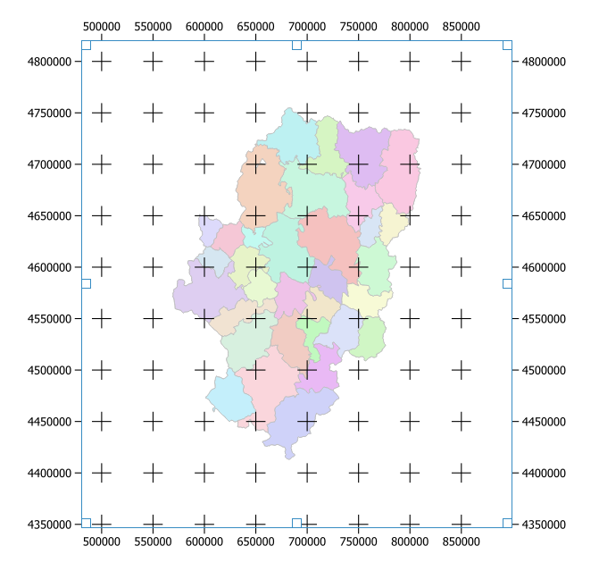

# Añadir retícula con coordenads

- En “Propiedades del elemento “, despliega - “Cuadrículas”:

- Pulsa  para crear una cuadrícula nueva.

- Define el tipo de cuadrícula:

- Define el estilo de marco:
  
  

- Activa "Dibujar coordenadas" y define el estilo y formato de las coordenadas. En este caso, se ha elegido “Decimal (UTM), y que las coordenadas aparezcan representadas en todos los lados del marco, en horizontal en los lados inferior y superior, y en vertical en la derecha e izquierda.

