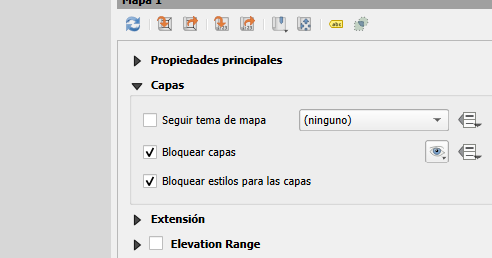
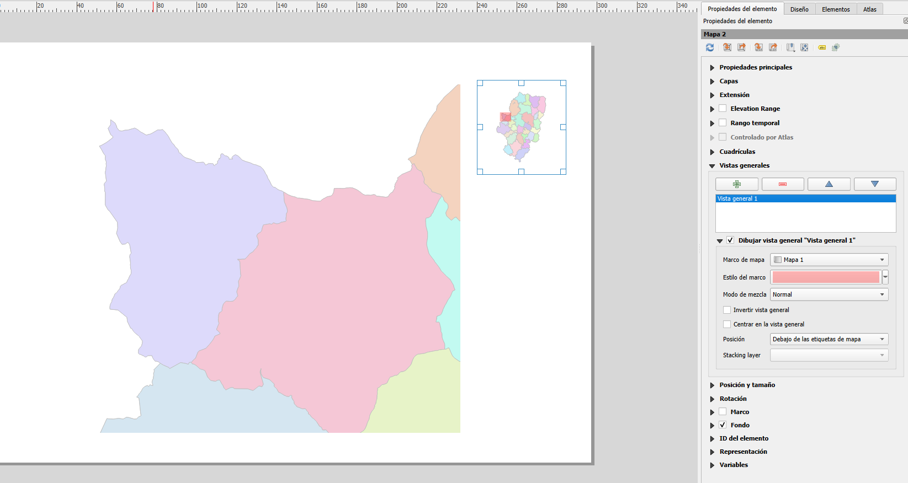

# Añadir localizador

- Definir simbolización y escala en la vista. 

- Crear un nuevo diseñador de impresión y añadir la vista al mapa.

- En las propiedades del elemento que contiene el mapa, activar “Bloquear capas para el elemento del mapa” y “Bloquear los estilos de la capa para el elemento del mapa”.

- Volver a la vista y definir el nivel de escala y la representación deseadas.

- Añadir la vista al diseñador de impresión.

- En la pestaña “Elementos” comprobamos que tenemos dos mapas en la misma composición.

- Acceder a las propiedades del elemento que contiene el mapa de localización.

- Desplegar la pestaña “Vistas Generales”

- Añadir nueva

- Activar la casilla “Dibujar vista general “Vista general 1”, en caso de que esté desactivada.

- En Marco de mapa, seleccionar el nombre de la composición de mapa inicial (en este caso, Mapa 1).

 [alt text](7.3.Añadir_localizador.md)
