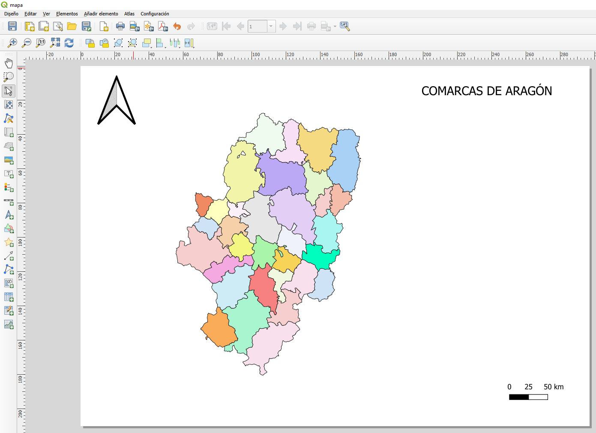
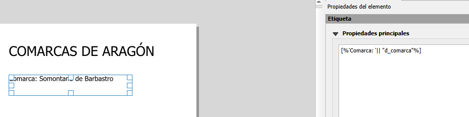
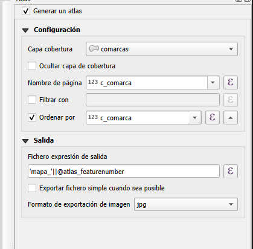
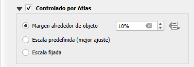
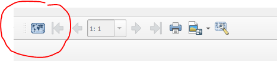
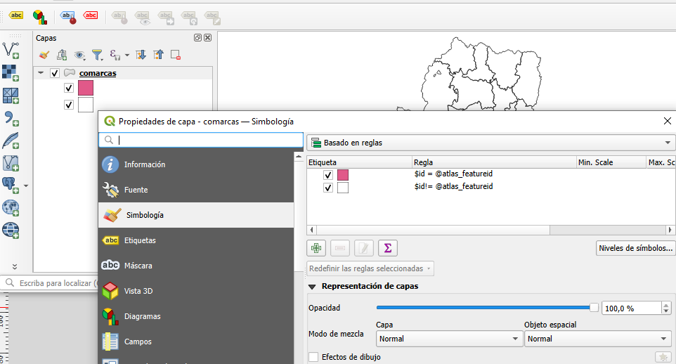

# Atlas de mapas

En este apartado de presenta un ejemplo de cómo crear un atlas de mapas a partir de los límites comarcales de Aragón.
Por tanto, el objetivo es que el programa genere una ficha para cada una de las comarcas, representando los elementos variables correspondientes.

## Preparación del mapa

Se prepara la composición del mapa, añadiendo los elementos fijos que queramos que aparezca en cada una de las composiciones de la serie cartográfica: sínmbolo del norte, título, etc.

## Añadir los elementos dinámicos

En este caso, mostraremos de forma dinámica el nombre de la comarca, su código y su superficie.

Para añadir el nombre:

## Generar atlas

En las propiedades de la composición, hay que activar la casilla "Generar un atlas".

Adicionalmente, se pueden configurar las siguientes opciones:

- Capa de cobertura: indica al atlas la capa que contiene los elementos a partir de los cuales se va a generar un mapa.
- Ocultar capa de cobertura: indica que no se muestre la capa que genera el atlas.
- Nombre de página: campo que funcionará como índice para el atlas.
- Filtar por: si se quiere incluir condiciones adicionales.
- Ordenar por: si quiere ordenarse por un campo concreto.

En Opciones de salida:

- Fichero de expresión de salida: nombre del fichero o ficheros que genera el atlas.
- Formato de exportación de imagen: formato de la ficha.

Seleccionar el elemento mapa, y en las propiedades del mismo activar la opción "Controlado por atlas".

Pulsar sobre el icono "Generar atlas" y navegar por las distintas composiciones de mapa:

Para resaltar en la composición de mapa el elemento del mapa que en ese momento está generando el atlas:

- En la vista, accede a la propiedad de la capa que genera el atlas.
- Selecciona "Simbología".
- Selecciona "Basado en reglas".
- Añade una regla nueva. En el constructor de expresiones, introduce: $id = @atlas_featureid
  
  

- Modifica el símbolo.
- Añade una regla nueva, procediendo de la misma manera. Ahora introduce esta expresión: $id != @atlas_featureid

- Acepta.