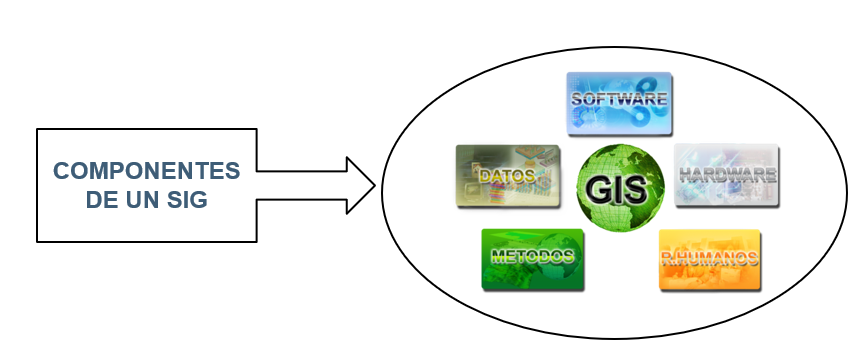

## License

This work is dedicated to the public domain under the [Creative Commons Zero (CC0) License](https://creativecommons.org/publicdomain/zero/1.0/).

# Introducción a QGIS

> **Un Sistema de Información Geográfica** se define como “Sistema de información que permite capturar, almacenar, manipular, analizar, modelizar y representar (mapa) datos espacialmente referenciados” (Moreno, 2006).

## QGIS: Herramienta Orientada al Manejo de Información Geográfica

QGIS (Quantum GIS) es una herramienta de software libre diseñada para trabajar con información geográfica. Permite visualizar, editar y analizar datos espaciales, ofreciendo una solución robusta y flexible para diversas aplicaciones geográficas.

### Operaciones GIS Más Habituales
Entre las operaciones más comunes que se pueden realizar con QGIS destacan:

- **Edición Cartográfica**: Permite la creación, modificación y gestión de datos espaciales a través de funciones avanzadas de edición.
- **Teledetección**: Ofrece herramientas avanzadas para el análisis de imágenes satelitales y de sensores remotos.
- **Morfometría e Hidrología**: QGIS integra funcionalidades para el análisis de relieves, cuencas hidrográficas, y otras características del terreno.
- **Diseño de Impresión**: Incluye herramientas para generar mapas impresos de alta calidad, personalizables según las necesidades del proyecto.
- **Soporte Multiformato**: Soporta una amplia variedad de formatos vectoriales (como Shapefiles, GeoJSON, KML) y formatos ráster (como GeoTIFF, JPG, PNG).

### Soporte de Formatos Vectoriales y Ráster
QGIS destaca por su capacidad para trabajar con múltiples tipos de datos, tanto vectoriales (puntos, líneas, polígonos) como ráster (imágenes georreferenciadas, modelos digitales de terreno), lo que lo hace ideal para una amplia gama de proyectos y disciplinas geográficas.

### Software de Código Abierto (Open Source)
Una de las grandes ventajas de QGIS es que es **software libre y de código abierto**. Esto significa que es gratuito, accesible para todos, y cuenta con una comunidad activa que contribuye al desarrollo y mejora continua de la herramienta.

### Integración con Otros GIS
QGIS se integra fácilmente con otras herramientas de análisis geoespacial como:

- **SEXTANTE**: Ofrece una colección de algoritmos para el procesamiento de datos espaciales.
- **GRASS GIS**: Sistema de análisis geoespacial que aporta funcionalidades avanzadas de análisis de datos.
- **SAGA GIS**: Potente software para el análisis científico de datos espaciales, especialmente útil en análisis geomorfológicos y de teledetección.

## ¿Por qué QGIS?

- **Portable**: funciona en distintas plataformas hardware / software: Windows, OS X, Linux y BSD. 
- **Modular**: es ampliable con nuevas funcionalidades una vez finalizado su desarrollo.
- **De código abierto**: el código fuente original con el que fue escrito está disponible.
- **Sin licencias**: una vez finalizado el desarrollo no habrá que pagar nada por cada instalación que se realice, sin límite de número.
- **Interoperable con las soluciones ya implantadas**: es capaz de acceder a los datos de otros programas propietarios, como ArcGIS, ArcView, AutoCAD o Microstation sin necesidad de cambiarlos de formato.
- **Sujeto a estándares**: sigue las directrices marcadas por el Open GIS Consortium (OGC) y la UE.
- **Amplia comunidad de desarrolladores**: desarrollo de numerosos Plugins.
- **Versiones LTR**: release de largo término que dispone de soporte durante un año. Únicamente corrigen errores de versiones anteriores pero no añaden funcionalidades adicionales.

