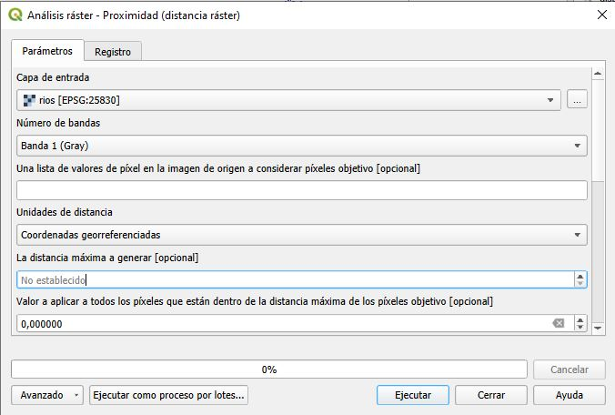

# Cálculo de distancias en un ráster en QGIS

Proximidad (distancia ráster)
Genera un mapa de proximidad ráster que indica la distancia desde el centro de cada píxel al centro del píxel más cercano identificado como píxel de destino. Los píxeles de destino son aquellos en el ráster de origen para los que el valor de píxel de ráster está en el conjunto de valores de píxeles de destino.

## 1. Abre la herramienta
Ve a la **Caja de herramientas de procesamiento** (generalmente en el panel superior o desde el menú **Procesos**) y busca la herramienta **"Proximidad (distancia ráster)"**.

  

## 2. Selecciona unidades de distancia
En nuestro caso, coordenadas georreferenciadas

## 4. Ejecuta la herramienta
Una vez completada la tabla de reclasificación, haz clic en **Aceptar** en el cuadro de diálogo de la tabla y luego en **Ejecutar** en la herramienta principal.

## 5. Guarda el resultado
QGIS generará un nuevo archivo ráster.