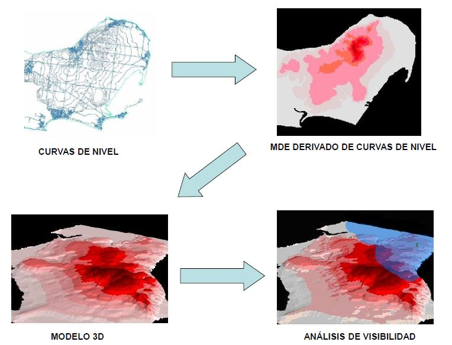

## Objetivos específicos
- Comprender conceptos de visibilidad y horizonte visual.  
- Aplicar análisis de visibilidad en QGIS.  
- Evaluar impacto de estructuras o relieves en la visualización de un área.  

## Análisis de visibilidad

El análisis de visibilidad permite determinar qué partes del terreno son visibles desde uno o varios puntos de observación, lo que se conoce como **cuenca visual** o **zona visible**.

Para realizar este estudio es imprescindible contar con datos altimétricos del área de interés, ya que solo a partir de ellos puede estimarse qué zonas resultan visibles y cuáles quedan ocultas.

En los modelos **ráster**, la altitud se asigna al centro de cada celda y, por extensión, a toda su superficie. Así, la celda constituye la unidad mínima de análisis, a la cual se le atribuye un valor que indica si es **visible** o **no visible** desde el punto de observación.

  

## Factores

#### Topografía
Modelo Digital de Elevaciones, que determina los puntos del terreno que quedan ocultos al observador si delante de ellos existen puntos del terreno que están a una altura superior.

#### Pantallas
Elementos que actúan como barreras e impiden la visión de las áreas a observar.

#### Altura del observador

El resultado es una capa (mapa) de la cuenca visual que diferencia, mediante números enteros, los píxeles que corresponden a zonas visibles de los que no.

#### Algunos más...

  

## Proceso

  

