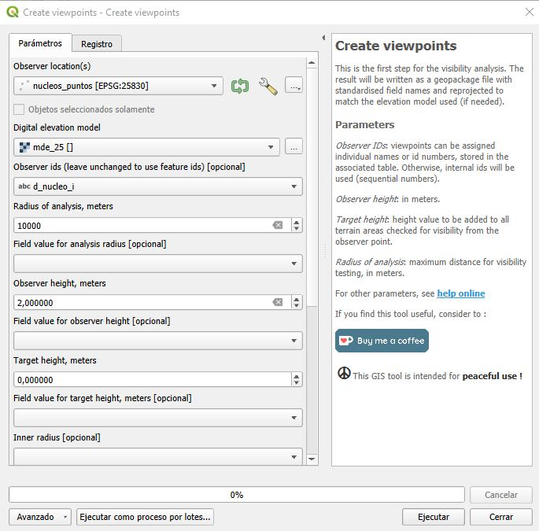

# Plugin Visibility Analysis

Facilita la realización de análisis de visibilidad en QGIS, produciendo un ráster en el que cada píxel refleja si es visible o no visible.

Entre sus principales características se encuentran:

- **Generación de visibilidad**: Permite conocer la cuenca visual desde un punto específico, así como generar visibilidad acumulada a partir de varios puntos.  

- **Extracción del horizonte visible**: Facilita la identificación del horizonte topográfico que puede observarse desde un punto determinado.  

- **Profundidad de invisibilidad**: Indica el tamaño mínimo que debe tener un objeto para ser percibido desde el punto de observación.  

- **Generación de redes de intervisibilidad**: Crea una red que refleja las relaciones visuales entre dos conjuntos de puntos o dentro de un mismo conjunto.

## Instalación

Accede al Administrador e Instalador de complementos (menú Complementos) y escribe en el buscado: "**Visibility Analysis**".

  

Una vez instalado, es accesible desde la **Caja de herramienta de procesos**

  

## Flujo de trabajo

El análisis de visibilidad se divide en dos pasos: primero se crea un conjunto de puntos de observación utilizando el módulo **Crear puntos de observación** , que luego se envían a otros módulos.

## Datos de entrada

- **Modelo digital de elevación** : modelo de terreno en formato ráster. Sólo se pueden utilizar datos ráster proyectados . No se permiten proyecciones de latitud/longitud, como WGS84.

- **Los puntos de observador/objetivo**  deben almacenarse en un shapefile u otro formato vectorial reconocido. No se pueden usar líneas ni polígonos (a menos que estén divididos en puntos). Los shapefiles multipunto tampoco funcionan. Si el sistema de coordenadas del punto difiere del modelo de elevación utilizado, los datos vectoriales se reproyectarán para que coincidan.

[**No usar datos en grados no proyectados** (lat/lon, WGS 84), ya que no son adecuados para cálculos precisos. Comprenda correctamente las proyecciones SIG antes de proceder.]

## Módulos

### Crear puntos de observación

Este es el primer paso del análisis de visibilidad. Los puntos de observación proporcionados se procesarán y se guardarán en un archivo con nombres de campos estandarizados. Si es necesario, los datos se reproyectarán para que coincidan con el modelo de elevación utilizado.  

Los datos dentro de la tabla pueden modificarse manualmente; sin embargo, los nombres y los tipos de datos de los campos **no deben cambiarse**.

#### Parámetros

Los parámetros obligatorios pueden establecerse como valores fijos, mientras que todos los parámetros también pueden leerse desde los campos de la tabla. Este último método es más propenso a errores: en caso de un problema (por ejemplo, un campo vacío), se aplicará el valor fijo especificado en el cuadro de texto o un valor por defecto. En caso de duda, revise el archivo generado y los **Mensajes del Registro** (información de la visibilidad).  

- **observer IDs**: los puntos de observación pueden recibir nombres o números de identificación individuales, almacenados en la tabla asociada. Si no se asignan, se usarán IDs internos (números secuenciales).  
- **Observer height**: en metros.  
- **Target height**: valor de altura que se sumará a todas las áreas del terreno que se comprueben para visibilidad desde el punto de observación.  
- **Radius of analysis**: distancia máxima para la prueba de visibilidad, en metros.

Se pueden utilizar los siguientes parámetros adicionales para enmascarar áreas específicas.  

- **Inner radius**: excluye la zona circular alrededor del punto de observación, hasta la distancia especificada.  
- **Azimuth start/stop**: excluye el área que no se encuentra entre los dos azimuts especificados. Tenga en cuenta que el azimut de inicio puede tener un valor mayor que el de fin. Tanto el rango de 10 a 30 grados como de 30 a 10 son válidos; en este último caso, se incluirán todas las direcciones excepto el rango de 10 a 30.  
- **Upper/lower angle**: determina el ángulo máximo y mínimo de visión. Las áreas por encima o por debajo de estos valores se excluirán, es decir, se registrarán como no visibles. El nivel horizontal (a la altura de los ojos) se considera 0 grados; los ángulos por debajo del nivel horizontal pueden llegar hasta -90°, y por encima hasta +90°. El ángulo inferior especificado debe ser menor que el ángulo superior.

  

### Viewshed

Este módulo realiza un cálculo de visibilidad para puntos individuales sobre un modelo de terreno (en formato raster). Se disponen de tres tipos de salida:  

- **Binary viewshed**: genera un mapa de visibilidad en el que cada punto del terreno recibe un valor verdadero/falso (visible/no visible).  
- **Depth below horizon**: proporciona la profundidad de las porciones del terreno que son invisibles. El valor generado puede interpretarse como la altura teórica que debería alcanzar una construcción para ser visible en el horizonte desde el punto de observación seleccionado.  
- **Horizon (horizonte)**: traza los bordes exteriores de la cuenca visual, representando los puntos que aparecen en el horizonte desde el punto de observación elegido.  

Cuando se utilizan múltiples puntos de observación, las cuencas visuales individuales se combinan en un modelo acumulativo que indica el número de resultados positivos para cada punto del terreno.  

#### Parámetros

- **Observer locations**: capa vectorial creada mediante la rutina **Create viewpoints**.  
- **Digital elevation model**:  Modelo Digital de Elvaciones.
- **Combining multiple outputs**: al usar varios puntos de observación, las cuencas individuales se pueden combinar en un solo modelo, ya sea sumando los valores o seleccionando los valores más bajos o más altos. La suma es adecuada para salidas binarias (verdadero/falso). Los valores de profundidad, en cambio, pueden filtrarse para obtener los más altos o los más bajos.  

- **Earth cuvature and Atmospheric Refraction**: Al igual que otros algoritmos de cuenca visual disponibles, es posible considerar los efectos de la **curvatura de la Tierra** y la **refracción de la luz** al atravesar la atmósfera. Este último efecto se debe a las diferencias de densidad y composición entre las capas de la atmósfera, como por ejemplo entre aire y agua. Estos parámetros son insignificantes a distancias cortas, especialmente en modelos de terreno de baja resolución.  

La siguiente fórmula se utiliza para ajustar los valores de altura en el DEM:

z_ajustado = z - (Dist² / Diam_Tierra) * (1 - Refracción)

Donde:  

- **Dist**: distancia planimétrica entre el punto de observación y el punto objetivo.  
- **Refracción**: coeficiente de refractividad de la luz (normalmente tiene un efecto opuesto, pero menor, al de la curvatura).  
- **Diam**: diámetro de la Tierra, estimado como radio ecuatorial + radio polar. Estos valores se toman del sistema de proyección asignado al raster por QGIS. En caso de error o valores irreales, se usan los valores por defecto: radio de 6378,137 km y achatamiento de 298,257.

  

### Intervisibility network

La salida de la rutina de **red de intervisibilidad** es una red en formato vectorial que representa las relaciones visuales entre dos conjuntos de puntos (o dentro de un mismo conjunto).  

Para cada enlace se calcula la **profundidad por debajo o por encima del horizonte visible**, ya que en muchos casos solo una porción del objetivo especificado es visible.
