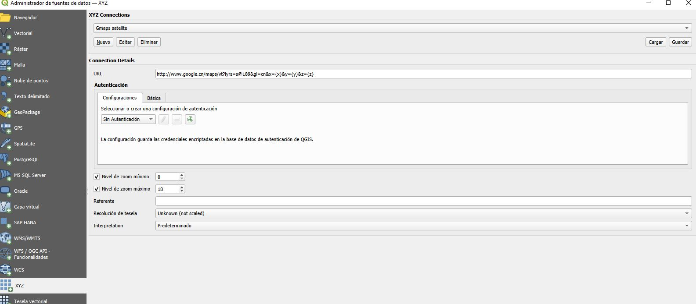

# Vista de mapa 3D

QGIS 3.0 incorpora una vista de capas en 3D que permite representar los datos SIG en tres dimensiones. Gracias a esta funcionalidad, es posible obtener una representación más realista de la información que incluye valores de altura o elevación, como los Modelos Digitales de Elevación (DEM). 

[Manual QGIS. Vista de Mapa 3D ](https://docs.qgis.org/3.40/es/docs/user_manual/map_views/3d_map_view.html)

---

### 🌍 Crear una vista 3D

1. Abre un proyecto en QGIS con las capas que quieras visualizar 
2. En el menú superior, selecciona: **Vista → Nueva vista de mapa 3D**.  
3. Se abrirá una nueva ventana independiente donde aparecerá tu mapa en tres dimensiones.

> 💡 Cada vista 3D es independiente del mapa principal, por lo que se pueden tener varias vistas con distintas configuraciones.

---

### ⚙️ Configurar el terreno

En el panel de configuración de la vista 3D se pueden ajustar distintos parámetros para mejorar la visualización:

- **Terreno base:** selecciona el **Modelo Digital de Elevación (DEM)** que servirá como base.  
- **Exageración vertical:** aumenta o reduce el relieve para resaltar diferencias de altura.  
- **Nivel de detalle:** controla la suavidad o precisión del modelo.

> 💬 En las zonas de poco relieve, es aconsejable una exageración vertical  para apreciar mejor la topografía.

---

### 🧱 Representar capas en 3D

Las capas vectoriales también pueden mostrarse en tres dimensiones:

- Si la capa tiene un **campo con valores de altura**, QGIS puede usarlo para situar los elementos a la altitud correcta.  
- Es posible aplicar **extrusión** para dar volumen a polígonos, como edificios, parcelas o áreas forestales.  
- Se pueden combinar capas vectoriales y ráster en la misma escena 3D para obtener una representación más completa del terreno.

---

### 🧭 Navegación en la vista 3D

- **Botón izquierdo:** rota la cámara.  
- **Botón derecho:** desplaza la escena.  
- **Rueda del ratón:** acerca o aleja (zoom).

---

### Añadir capas de Google maps

Para añadir mapas base en QGIS 3.x debemos ir al menú superior Capa → Administrador de fuentes de datos → Navegador -> XYZ

- Google Maps: https://mt1.google.com/vt/lyrs=r&x={x}&y={y}&z={z}
- Google Satellite: http://www.google.cn/maps/vt?lyrs=s@189&gl=cn&x={x}&y={y}&z={z}
- Google Hybrid: https://mt1.google.com/vt/lyrs=y&x={x}&y={y}&z={z}
- Google Terrain: https://mt1.google.com/vt/lyrs=t&x={x}&y={y}&z={z}
- Google Traffic: https://mt1.google.com/vt?lyrs=h@159000000,traffic|seconds_into_week:-1&style=3&x={x}&y={y}&z={z}
- Google Roads: https://mt1.google.com/vt/lyrs=h&x={x}&y={y}&z={z}

